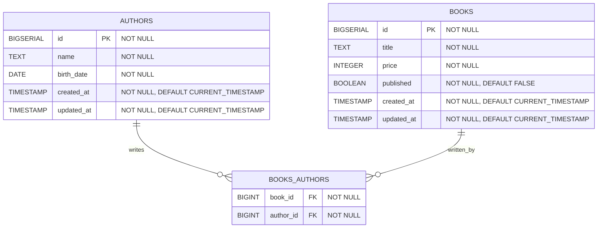

# ER 図（書籍管理システム）

以下は、本プロジェクトで利用するデータベース構造を mermaid の ER 図として表現したものです。

```mermaid
erDiagram

    AUTHORS {
        BIGSERIAL id PK "NOT NULL"
        TEXT name "NOT NULL"
        DATE birth_date "NOT NULL"
        TIMESTAMP created_at "NOT NULL, DEFAULT CURRENT_TIMESTAMP"
        TIMESTAMP updated_at "NOT NULL, DEFAULT CURRENT_TIMESTAMP"
    }

    BOOKS {
        BIGSERIAL id PK "NOT NULL"
        TEXT title "NOT NULL"
        INTEGER price "NOT NULL"
        BOOLEAN published "NOT NULL, DEFAULT FALSE"
        TIMESTAMP created_at "NOT NULL, DEFAULT CURRENT_TIMESTAMP"
        TIMESTAMP updated_at "NOT NULL, DEFAULT CURRENT_TIMESTAMP"
    }

    BOOKS_AUTHORS {
        BIGINT book_id FK "NOT NULL"
        BIGINT author_id FK "NOT NULL"
    }

    AUTHORS ||--o{ BOOKS_AUTHORS : "writes"
    BOOKS ||--o{ BOOKS_AUTHORS : "written_by"
```
